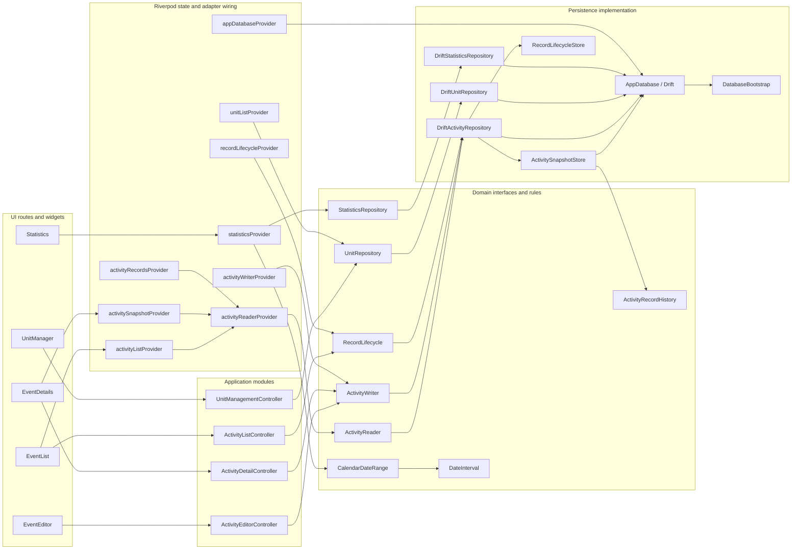
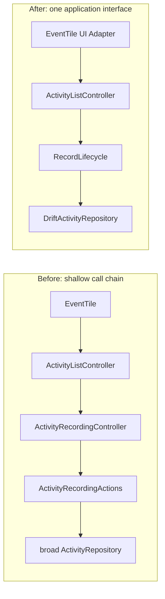
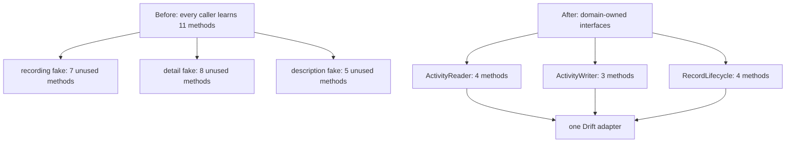
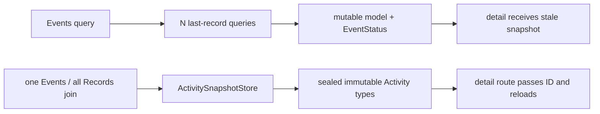
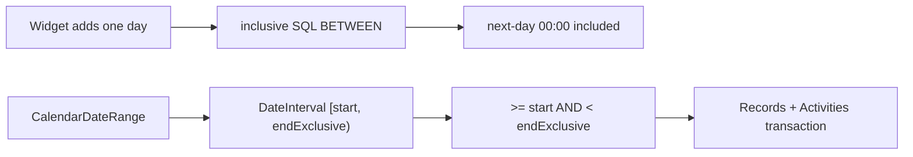
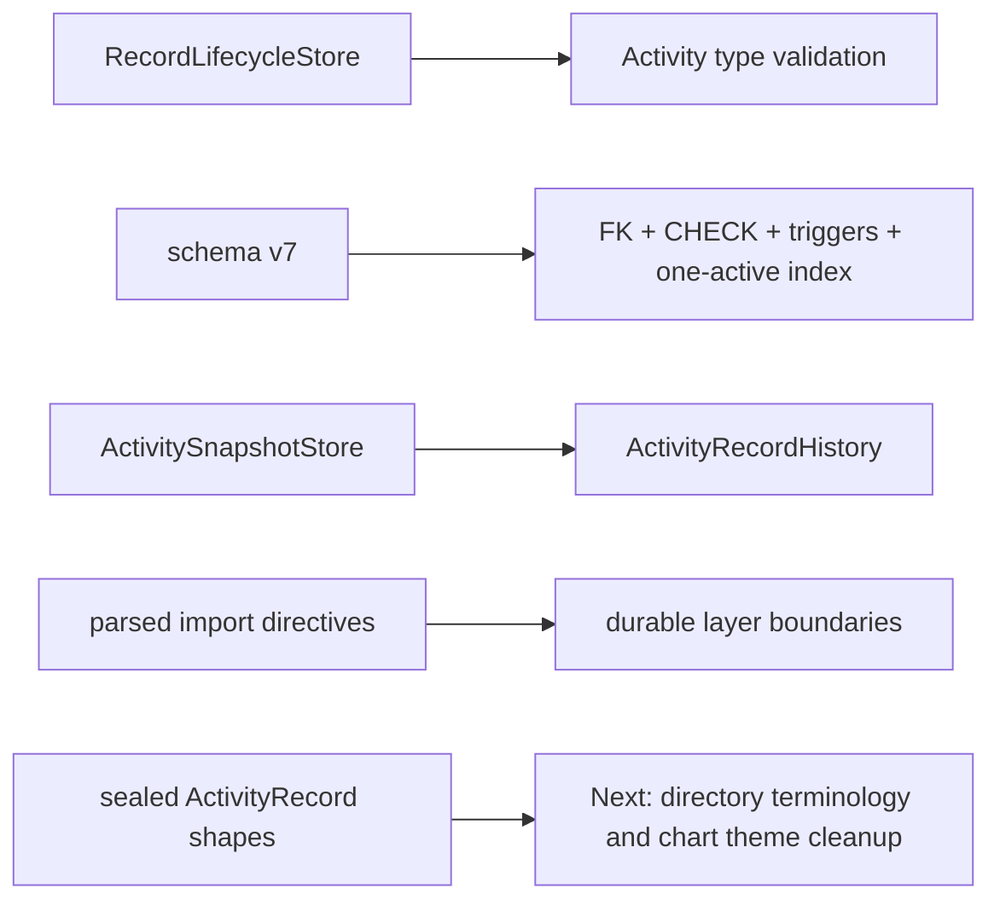

# Module Flow

This document keeps the current architecture visible while the repo is being refactored. It should change when module ownership changes.

## Current Shape

## Deepened Activity Recording

`ActivityListController` now owns type dispatch, optional value prompts, the five-second accidental-start rule, refresh, and notification policy. The deleted outcome enum and pass-through controller no longer form part of the Interface.

## Repository Seams

Production wiring projects one `DriftActivityRepository` Adapter through three narrow Interfaces. Tests use purpose-built in-memory Adapters without unrelated `UnimplementedError` methods.

## Deepened Activity Snapshot

Active state and totals now come from Records through `ActivityRecordHistory`. Schema v4 removed `lastRecordId`, `sumTime`, and `sumVal`; malformed histories fail at one Interface, and the domain model cannot represent an active Timed Activity without a start time.

## Deepened Statistics Range

Calendar-day selection and timestamp interval semantics now have separate Interfaces. The Widget displays inclusive days; persistence receives one half-open interval and reads a consistent snapshot.

## Current Enforcement And Next Work

Records are the sole persisted fact for Activity state and totals. The first four
nodes are already enforced. The remaining work is constrained by the scope and
acceptance criteria in `docs/plans/2026-07-10-unified-quality-execution.md`.
Product behavior stays protected by unit, persistence, migration, and widget
tests. The architecture suite checks only dependency direction from parsed Dart
syntax, so internal renames and implementation changes do not create false
regressions.
