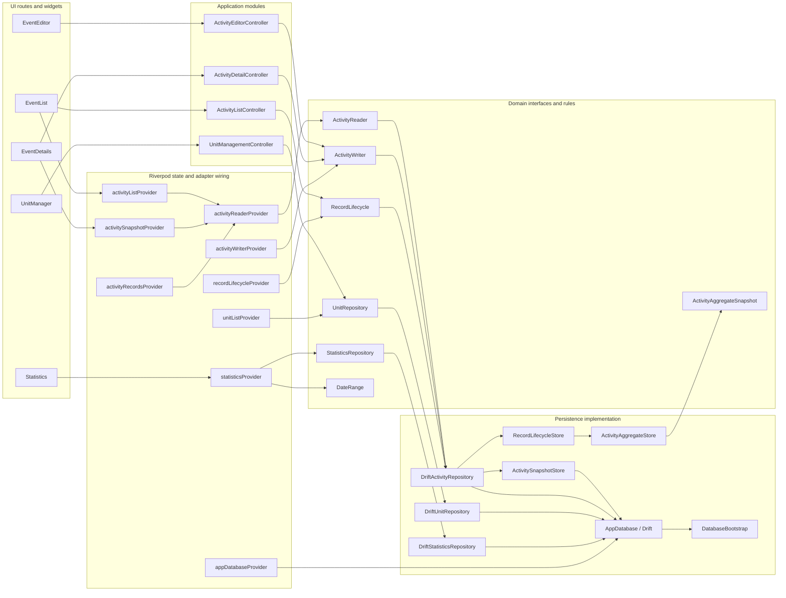
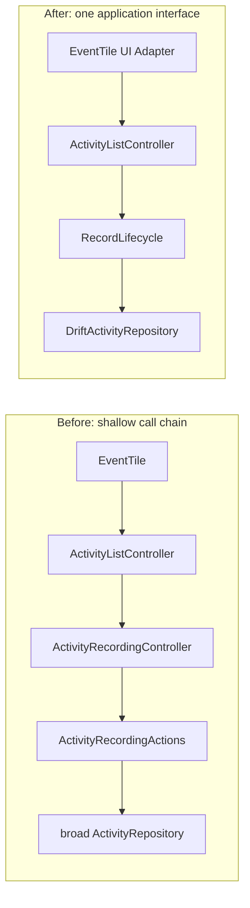
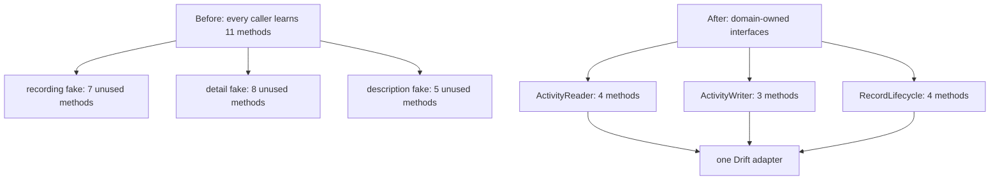
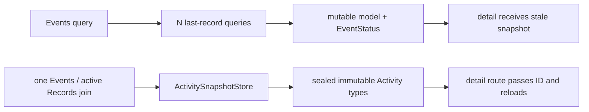
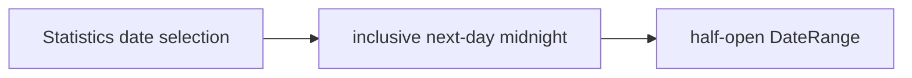

# Module Flow

This document keeps the current architecture visible while the repo is being refactored. It should change when module ownership changes.

## Current Shape

## Deepened Activity Recording

`ActivityListController` now owns type dispatch, optional value prompts, the five-second accidental-start rule, refresh, and notification policy. The deleted outcome enum and pass-through controller no longer form part of the Interface.

## Repository Seams

Production wiring projects one `DriftActivityRepository` Adapter through three narrow Interfaces. Tests use purpose-built in-memory Adapters without unrelated `UnimplementedError` methods.

## Deepened Activity Snapshot

Active state now comes from active Records rather than cached `lastRecordId`, malformed histories fail at one Interface, and the domain model cannot represent an active Timed Activity without a start time.

## Next Deepening

The next slice should make Statistics interval semantics explicit and keep its Records/Activities read consistent.
