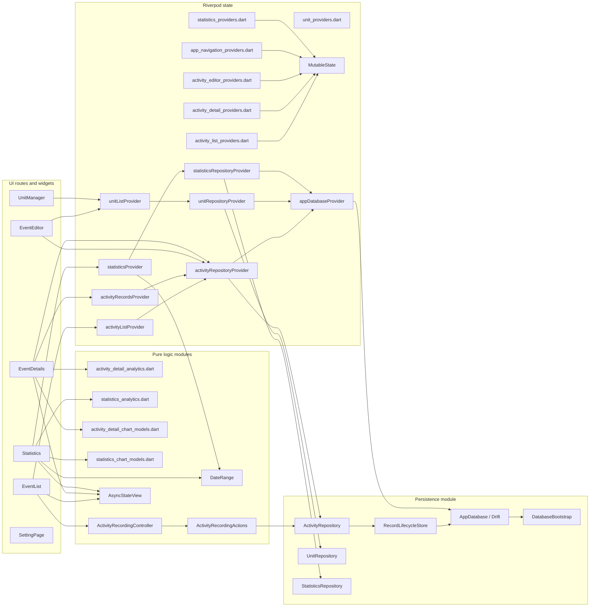
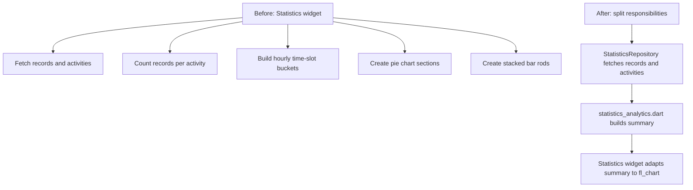
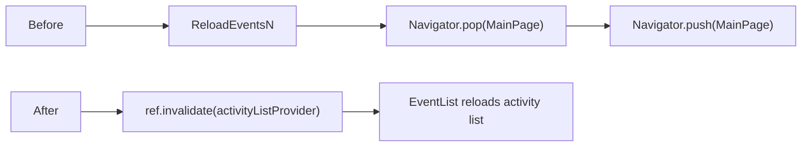
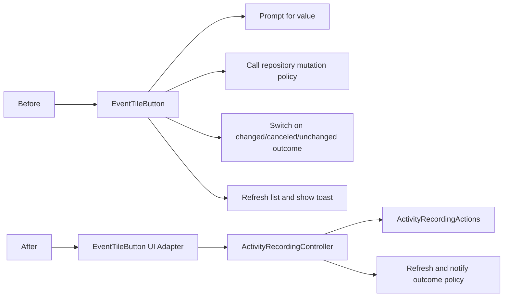
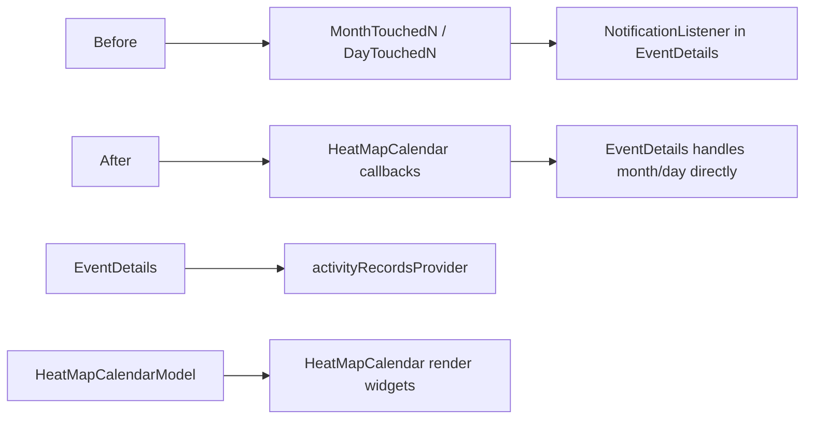
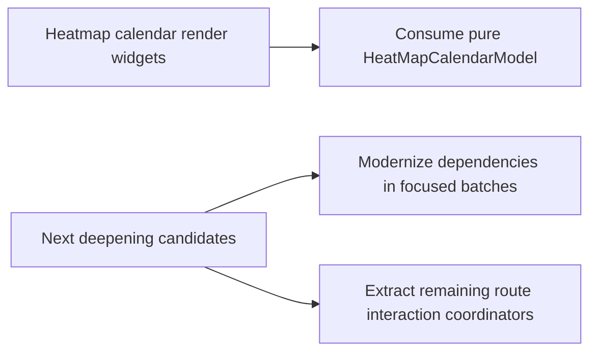

# Module Flow

This document keeps the current architecture visible while the repo is being refactored. It should change when module ownership changes.

## Current Target Shape

## What Changed

### Statistics

### Activity List Refresh

### Activity Recording Interaction

### Activity Details Heatmap

The direction is to keep record and activity rules in pure modules or repositories, and keep widgets focused on rendering and interaction.

## Still To Improve

